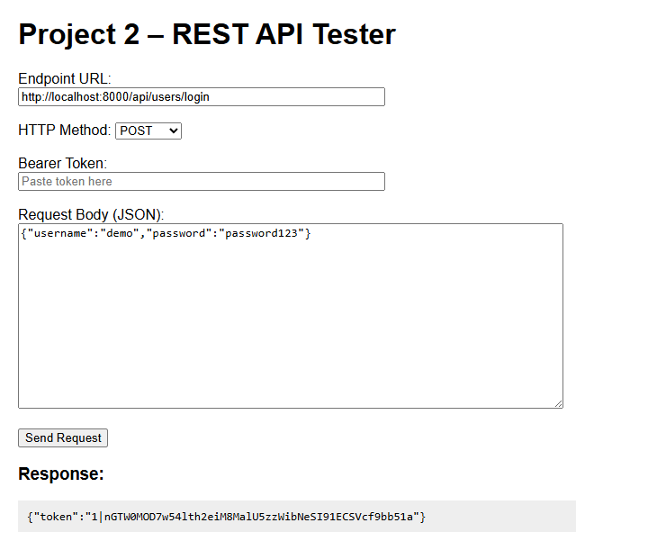
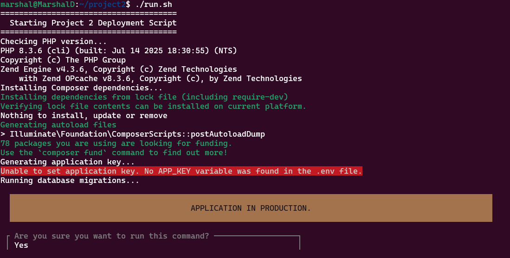
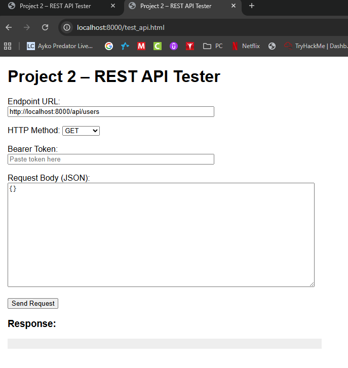

# Project 2 – Screenshots & Explanations

This page displays all screenshots taken during development and testing of the Project 2 REST API.

---

## Docker Containers Running
Confirms the Laravel app, MySQL database, and phpMyAdmin are all running.

---

## phpMyAdmin Connected to MySQL
phpMyAdmin is successfully connected to the `project2` database, showing tables created by Laravel migrations.

---

## API – List Users (`GET /api/users`)
Displays JSON output from querying all users.

---

## Create User (`POST /api/users`)
Valid user creation using the `/api/users` endpoint.

---

## Login & Token Response (`POST /api/users/login`)
Shows a successful login that returns a valid Sanctum token.

---

## Update Username (`PUT /api/users/{id}`)
A user successfully updated their username. The screenshot shows the request and the updated response.

---

## Update Password (`PUT /api/users/me/password`)
Password successfully changed using Bearer token authentication.

---

## Database Migration
Shows the output of Laravel migrations running successfully inside the Docker application container.

---

## Deployment Script Output
Screenshots show your automated run script performing:
- Composer install  
- Docker build and up  
- Key generation  
- Database migrations  

---

## API Tester Loaded in Browser
Your `test_api.html` API tester running successfully.

---

## Summary
These screenshots collectively demonstrate:

- Full Docker environment working  
- MySQL and phpMyAdmin functionality  
- REST API endpoints functioning correctly  
- Login and token authentication  
- User CRUD operations  
- Deployment and migration workflow functioning end-to-end  
